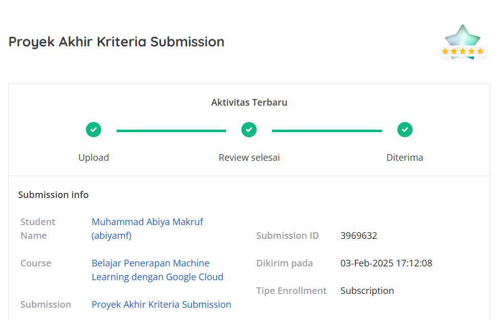
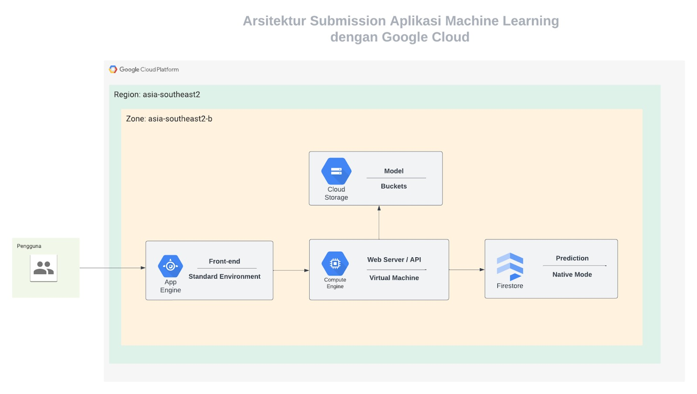

# Proyek Akhir: Belajar Penerapan Machine Learning dengan Google Cloud
## Penilaian Proyek
Proyek ini berhasil mendapatkan bintang 5/5 pada submission dicoding course Belajar Penerapan Machine Learning dengan Google Cloud.



Kriteria tambahan yang saya kerjakan sehingga mendapatkan nilai terbaik:
1. Dalam memberikan hak akses ke auditor eksternal, Anda harus menerapkan principle of least privilege.
2. Melakukan deployment aplikasi backend menggunakan layanan Cloud Run.
3. Menambahkan endpoint baru yang bertujuan sebagai riwayat prediksi dengan cara mengambil seluruh data yang telah Anda simpan di Firestore.

# 🚀 Backend Deployment - Asclepius

Selamat datang di repository backend **Asclepius**! 🎉
Backend ini dikembangkan menggunakan **Hapi.js** dan **Google Cloud Platform (GCP)** untuk mendukung aplikasi Machine Learning dalam mendeteksi kanker kulit.

---

## 🏗️ Arsitektur Cloud
Berikut adalah ilustrasi arsitektur cloud yang digunakan dalam proyek ini:



---

## 🏥 Contoh Gambar Prediksi
Berikut adalah contoh gambar untuk prediksi **Cancer** dan **Non-Cancer**:

### **1️⃣ Gambar Contoh - Cancer**


### **2️⃣ Gambar Contoh - Non-Cancer**


---

## 📌 Fitur Utama
- **Prediksi Kanker Kulit** 🏥
- **Simpan Data Hasil Prediksi ke Firestore** 🗂️
- **Riwayat Prediksi** 📜
- **Deployment dengan Cloud Run** ☁️

---

## 🛠️ Teknologi yang Digunakan
- **Node.js** + **Hapi.js**
- **Google Cloud Run** (Deployment)
- **Cloud Storage** (Menyimpan model ML)
- **Firestore** (Menyimpan hasil prediksi)
- **Artifact Registry** (Menyimpan container image Docker)
- **TensorFlow.js** (Inference Model ML)

---

## 🔧 Cara Menjalankan Backend Secara Lokal
### **1️⃣ Clone Repository**
```sh
git clone https://github.com/username/Asclepius-backend.git
cd Asclepius-backend
```

### **2️⃣ Install Dependencies**
```sh
npm install
```

### **3️⃣ Setup Environment Variable**
Buat file `.env` di root proyek dan tambahkan:
```
MODEL_URL='<your_bucket_url.json>'
```

### **4️⃣ Jalankan Server** 🚀
```sh
npm run start
atau
npm runt start:dev
```
Backend akan berjalan di `http://localhost:8080`

---

## ☁️ Deployment ke Cloud Run
### **1️⃣ Build & Push Docker Image** 🐳
```sh
docker build -t backend .
docker tag backend asia-southeast2-docker.pkg.dev/<NAMA PROJECT>/my-repo/backend
docker push asia-southeast2-docker.pkg.dev/<NAMA PROJECT>/my-repo/backend
```

### **2️⃣ Deploy ke Cloud Run** 🚀
```sh
gcloud run deploy backend-service \
    --image asia-southeast2-docker.pkg.dev/<NAMA PROJECT>/my-repo/backend \
    --platform managed \
    --region asia-southeast2 \
    --allow-unauthenticated
```

Backend akan tersedia di **Cloud Run URL** yang diberikan setelah deploy berhasil. Pastikan sudah memiliki docker dekstop.

---

## 📌 Pengujian API dengan Postman
Ketika membangun aplikasi machine learning, penting untuk menguji API agar sesuai dengan kriteria yang telah ditentukan.

### 📥 **Mengunduh Berkas Uji**
Berkas **Postman Collection** dan **data testing** tersedia di folder `./postman`.

### 🔄 **Import Postman Collection**
1. **Buka Postman** dan klik tombol **Import** di bagian atas.
2. Pilih **Folder** dan arahkan ke lokasi **Postman Collection** di dalam folder `./postman`.
3. Setelah import selesai, Anda akan melihat **folder berisi beberapa request API**.

> **Catatan:** Request dengan **tag `[Mandatory]`** harus berhasil dijalankan tanpa error jika ingin memastikan program berjalan dengan baik. 

4. **Atur Environment Postman**:
   - Buka tab **Environments** di Postman.
   - Pilih **Asclepius**.
   - Ganti `initial value` dan `current value` dengan **backend URL Anda**.

5. **Tentukan lokasi data uji Postman**:
   - Klik ikon **pengaturan** di pojok kanan atas Postman.
   - Pilih **General > Location > Choose** dan arahkan ke lokasi folder `./postman/data-test-submissions`.

Postman siap digunakan! 🚀
Silakan jalankan pengujian dan pastikan semua request dalam folder **Asclepius Mandatory** berhasil tanpa error.

---

## 📌 Endpoint API
### **1️⃣ Prediksi Kanker Kulit** 🔍
**POST** `/predict`
```json
{
   "status": "success",
   "message": "Model is predicted successfully",
   "data": {
       "id": "77bd90fc-c126-4ceb-828d-f048dddff746",
       "result": "Cancer",
       "suggestion": "Segera periksa ke dokter!",
       "createdAt": "2023-12-22T08:26:41.834Z"
   }
}
```

### **2️⃣ Mendapatkan Riwayat Prediksi** 📜
**GET** `/predict/histories`
```json
{
   "status": "success",
   "data": [
       {
           "id": "13e907b3-4213-42ad-b12b-b9b7e12eb90e",
           "history": {
               "result": "Cancer",
               "createdAt": "2023-12-22T10:04:40.341Z",
               "suggestion": "Segera periksa ke dokter!"
           }
       }
   ]
}
```

### **3️⃣ Error Handling** ⚠️
#### **Gambar lebih dari 1MB**
**Status Code: 413**
```json
{
   "status": "fail",
   "message": "Payload content length greater than maximum allowed: 1000000"
}
```

#### **Format/Shape gambar tidak sesuai atau error prediksi**
**Status Code: 400**
```json
{
   "status": "fail",
   "message": "Terjadi kesalahan dalam melakukan prediksi"
}
```

---

## 🤝 Kontribusi
Jika ingin berkontribusi, silakan fork repository ini dan buat pull request! 😊

---

**🚀 Selamat Deploying!** 🎉


